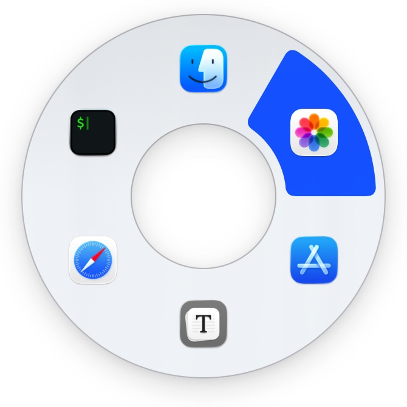
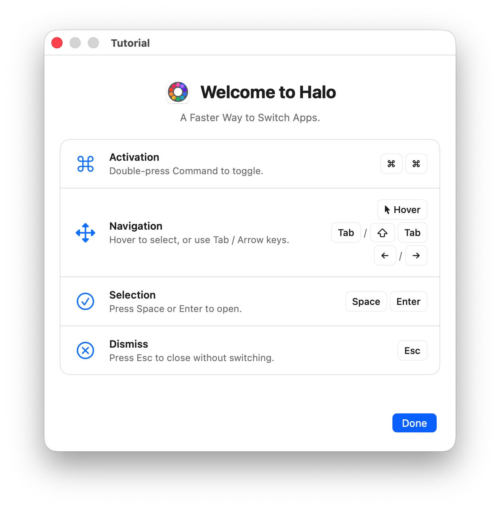
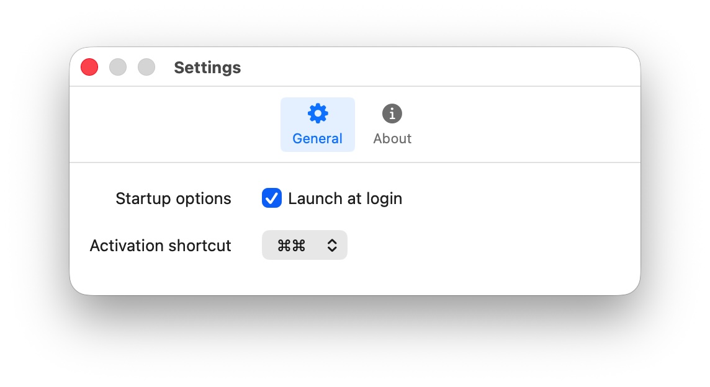

  <picture>
    
  </picture>

<h1 align="center">HaloAppSwitcher</h1>

  <strong>A Faster Way to Switch Apps on macOS.</strong>

  <a href="#features">Features</a> •
  <a href="#installation">Installation</a> •
  <a href="#screenshots">Screenshots</a> •
  <a href="#license">License</a>

HaloAppSwitcher brings a beautifully designed circular interface to macOS app switching. Simply double-tap the Command key to access all your running apps in an elegant ring layout, making multitasking effortless and intuitive.

## Features

- **Elegant Ring Interface** — All running apps displayed in a stunning circular layout. Find what you need at a glance.
- **Simple Activation** — Double-tap Command (⌘⌘) to trigger the switcher. No complex key combinations required.
- **Zero Permissions Required** — Works out of the box without accessibility permissions. Your privacy stays protected.
- **Smooth Interactions** — Hover to highlight, click to switch. Fluid animations make every interaction feel natural and responsive.
- **Menu Bar App** — Lives quietly in your menu bar, not your Dock. Appears instantly when you need it.
- **Launch at Login** — Optional auto-start keeps your productivity tool ready whenever you are.

## Installation
### App Store
Download from the [Mac App Store](https://apps.apple.com/us/app/haloappswitcher/id6759520369?mt=12).

## Screenshots
| Halo Ring | Tutorial | Preferences |
| --- | --- | --- |
|  |  |  |

## License

Questions or licensing inquiries → danlirencn@qq.com

  Made by <a href="https://github.com/zhuleon">Zhu Leon</a>

